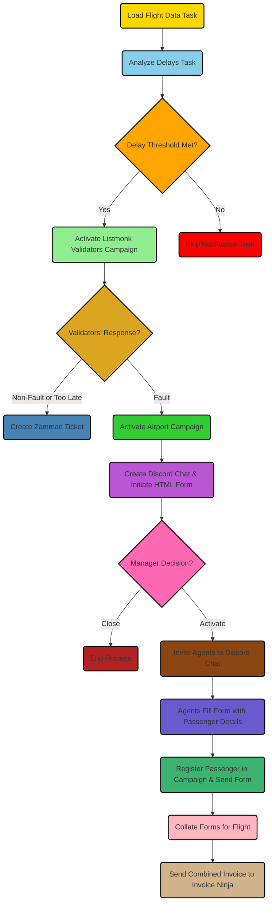

Flight Delay Claim Automation Plan
----------------------------------

This plan is divided into two main sections - the already implemented portion and the enhancements planned for implementation.

### Part 1: Current System \[Implemented\]

The current system relies on automated monitoring of delayed and cancelled flights which meet specified criteria. The detection process is executed by Apache Airflow and initiated through a Jenkins pipeline. Upon identifying a qualifying flight, the Jenkins pipeline sets off a Listmonk campaign titled "Validators".

**Existing Components:**

* **Apache Airflow:** Responsible for monitoring flight status and identifying qualifying flights.
* **Jenkins:** Initiates the pipeline based on defined conditions.
* **Listmonk:** Executes the Validators campaign upon receipt of the signal from Jenkins.

### Part 2: Proposed Enhancements \[To be Implemented\]

The planned enhancements involve the addition of an interactive HTML form within Discord, the creation of administrative tasks via Zammad tickets, the activation of airport agent campaigns, and the generation of invoices through Invoice Ninja.

**New Components & Processes:**

1. **Validators Channel on Discord:** This private Discord channel is the landing space for the HTML form generated through the Listmonk campaign. Validators have three response options:
    
    * **Non-fault:** The airline is not at fault. This option generates an administrative task in Zammad.
    * **Too late:** The form's window of relevance has closed. This option has the same outcome as 'non-fault'.
    * **Fault:** The Validator adds additional details to the form.
2. **Airport Campaign Activation:** When the 'Fault' option is selected, the Airport campaign is activated. Agents are alerted via a 15-minute Listmonk campaign notification, instructing them to report to the airport.
    
3. **Manager Interaction on Discord:** A new chat, tagged with the relevant flight number, is initiated for the manager on Discord. The manager can then:
    
    * **Close:** This requires no further action.
    * **Activate:** Edit the form and circulate it within the chat. The manager can also invite agents to the chat, granting them access to the form.
4. **Agent Form Submission:** Agents are able to fill out the final form with passenger-specific details (email, title, name, phone, etc.). This action registers the passenger as a subscriber to the campaign, simultaneously dispatching a form with general and agent-entered details.
    
5. **Invoice Generation:** At the conclusion of the campaign, all forms relevant to the flight are collated and dispatched to Invoice Ninja webhook as a consolidated invoice. Each form is tagged with the details of the agent who submitted it on behalf of each passenger.
    

**Additional Component:**

* **Zammad:** This tool is used for managing tickets when 'non-fault' or 'too late' options are chosen by Validators.

**Communication Tool:**

* **Discord:** This platform facilitates all the communications, form filling activities and management-level discussions.

**Please Note:** Protecting privacy and ensuring security should be central to all processes involving personal data. All communications should be encrypted, and data should be stored in a secure manner in line with applicable local legislation and best practices.
