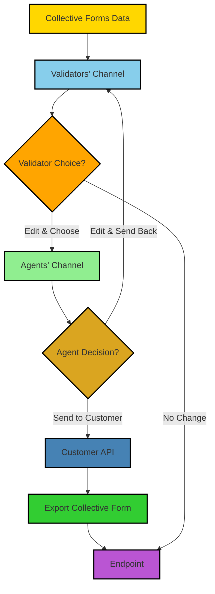

**Explanation**:

1. We start with **Collective Forms Data** (Node A). These are all the data of collective forms in their draft state.
    
2. These forms are sent to the **Validators' Channel** (Node B), where validators have the opportunity to review the forms.
    
3. The validators make a choice (**Validator Choice?** Node C), they can either edit and choose a form or leave it as is.
    
4. If a form is edited and chosen, it is sent to the **Agents' Channel** (Node D).
    
5. At this point, the agent has a decision to make (**Agent Decision?** Node E). They can either edit the form and send it back to the Validators' Channel for review or send the form to the customer through a specific API (**Customer API** Node F).
    
6. After the customer has been sent the form, we can export the collective form (Node G) to the endpoint (Node H) I shared with you earlier.
    
7. If the validator chooses not to change the form at Node C, it can directly be sent to the endpoint (Node H).
    
8. All individual forms belonging to a collective can be altered by the validator via the collective form itself, thereby maintaining the integrity and consistency of the data.
